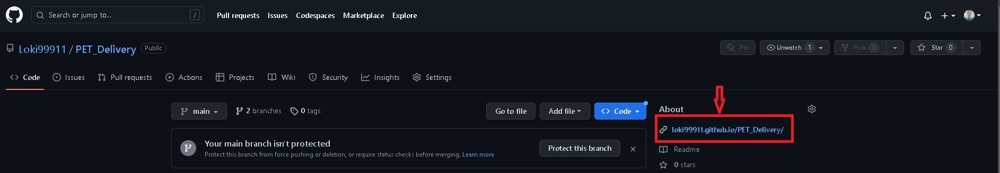
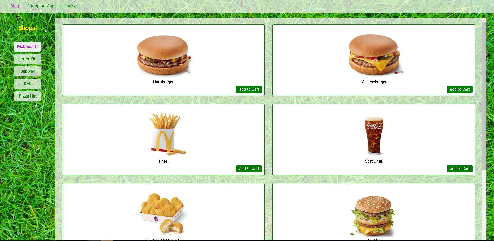

# Delivery

This is a repository for the PET Delivery project, an online food delivery service.
***

## How to use

### Use on-line

To use the application online, you can use a direct link on GitHub:

 Or faster you can use this link: **[https://loki99911.github.io/Followers](https://loki99911.github.io/Followers)**

### Use localy

To use the application localy, follow next steps:

1. Clone the repository to your computer: `git clone` *https://github.com/Loki99911/Followers*
2. Navigate to the project directory: `cd UserCardFollowers`
3. Install dependencies of project: input `npm install` in console.
4. Start the development server: `npm start`
5. It will open a new tab in the your browser: *http://localhost:3000*.

#### If you have done everything correctly, you will see the following pages:

***

## Technologies

The project is built with [React](https://react.dev/) using [Axios](https://axios-http.com/) library to interact with the [MockAPI](https://mockapi.io/) and styled by [Styled-components](https://styled-components.com/).
***

## Developed by:
_Juniog Frontend Developer - Nikita Kresik_:
**[GitHub](https://github.com/Loki99911)**,
**[Linkedin](https://www.linkedin.com/feed/)**
***